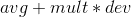

  

A trading software that use a mean reversion algorithm to predict trend in regolar time spans and make transaction to Trading212 broker service using the Trading212 APIs (that I've made before).

## Behavior

### Algorithm

The algorithm used is the Mean Reversion with this formula:

  

with `avg` as a **price average**, `mult` for a **costant** and `dev` for a **deviation**. In my tests I found most effective the use of a _linear regression_ as `price average` and a finantial index named _Average True Range_ (that defines volatility) as `deviation`.

## Developing

Will be used these _Design Patterns_:

- creational: _`singleton`_
- structural: _`Proxy`_, _`Decorator`_
- behavioral: _`Chain of responsability`_, _`Strategy`_, _`State`_

### Main Libraries

- Telegram API
- Trading212 API

The `Bot` uses Telegram APIs to communicate with the user news and receive commands (asyncronously) and Trading212 API to make transactions and drive predictive algorithms.
